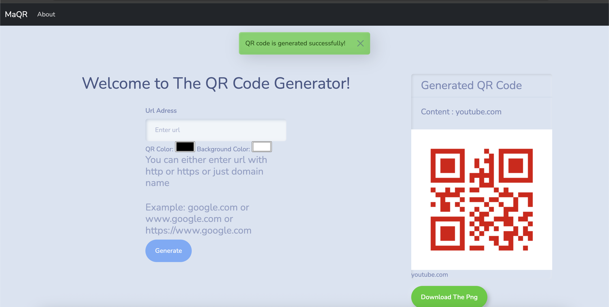
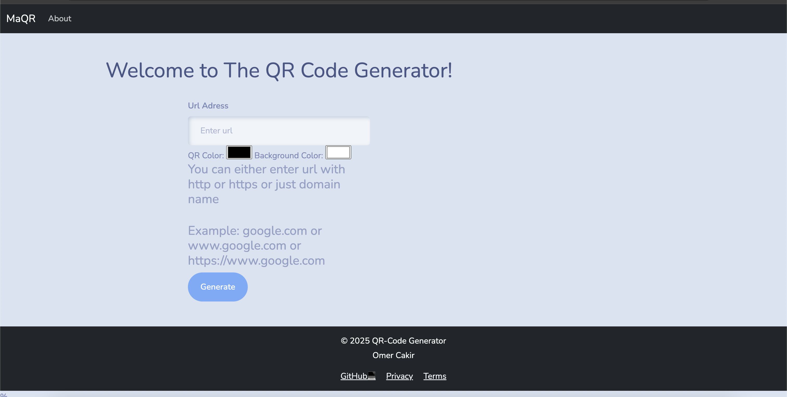

# 🎯 QR Code Generator Web App

A simple and customizable Django-based web application that allows users to generate QR codes from URLs. It features URL validation, success messaging, live QR preview, and easy downloads.

---

## 📷 Preview

<div align="center">
  
  <br><br>
  
</div>

---

## 🚀 Features

- 🎨 Customizable foreground and background colors
- ✅ Form validation with user-friendly alerts
- 📥 Instant download button for your QR code
- 🖼️ Live preview after submission

---

## 🛠️ Technologies Used

- **Python 3**
- **Django Framework**
- **qrcode** Python library
- **HTML/CSS (Bootstrap)**
- **JavaScript** for live input validation

---

## 📁 Project Structure

```
QR_APP/
│
├── QR_App/
│   ├── templates/
│   │   ├── base.html
│   │   └── about.html
│   │   └── home.html    
│   ├── static/
│   └── utils.py        # Contains the MakeQR() function
│
├── sample_pngs/        # Screenshots folder
│   ├── screenshot1.png
│   └── screenshot2.png
│
└── manage.py